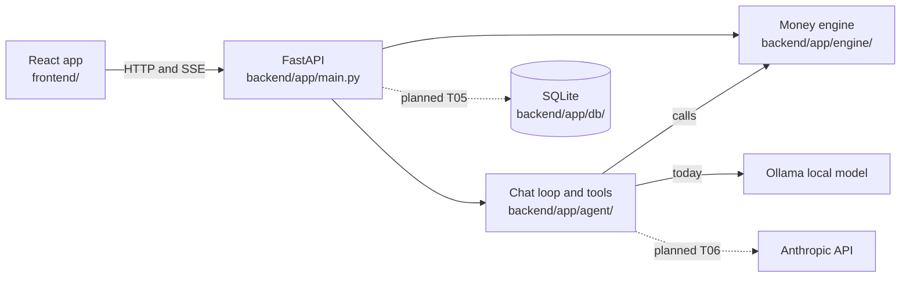

# codelinc11: Dental Benefits Copilot

An assistant for people with employer dental insurance. It answers three questions in plain language: **What will this procedure cost me? When should I schedule my care to pay the least? What do I still have left this year?** Built for the codeLinc 11 hackathon (Path 1, dental) by a five-person team using a team of AI coding agents.

> **Status (2026-10-03, Stage 0 of the build):** the foundation is in place, but the product is **not finished**. The money engine, the API and the household database work and are tested. The six real pages, the household API and the AI assistant on Anthropic are **not built yet**. See [What works today](#what-works-today) and [docs/TASKS.md](docs/TASKS.md).
> All plan, fee and member data is **synthetic**. Nothing here is a real plan or a real person.

## What works today

| Area | Built and tested | Not built yet |
|---|---|---|
| Money engine | Estimate with a step-by-step trace, in and out of network, deductible, yearly maximum, frequency limits, Plan My Year scheduler, benefits status, savings tips, dentist-question list, dentist-quote parser | Annual-cost calculator for the plan comparison (T05) |
| API (FastAPI) | `/estimate`, `/schedule`, `/benefits-status`, `/procedures`, `/plans`, `/savings-tips`, `/questions`, `/treatment-plan/parse`, `/reminders.ics`, `/health`, `/chat` (streamed) | Household, sign-in and per-member endpoints (T05) |
| Database (SQLite) | Households, members, roles, per-person usage, history, schedule, assistant context, invites, with access rules | Wired into the API (T05) |
| Frontend (React) | Portal-style shell, six routes, member switcher, assistant button, style guide at `/style` | The six real pages (T07 to T12), sign-in screen (T17). Pages show placeholders and a mock household for now |
| AI assistant | Tool loop with a number guard, local Ollama model | Anthropic provider and per-person context (T06). With no model reachable the chat says it is unavailable |
| CI | None | GitHub Actions (T16) |

## Planned product (six pages)
Home, Plans, Family, Costs, Plan My Year, Assistant (plus a chat button on every page). A household signs in, switches between family members, and each person sees their own benefits and gets assistant answers based on their own data. Details: [docs/decisions/README.md](docs/decisions/README.md).

## How it is built
The **engine does the math and the AI explains it**. Every dollar figure comes from `backend/app/engine/`. The language model never calculates a dollar amount, and a number guard in `backend/app/agent/guard.py` checks that figures in an answer came from a tool result.



Dashed lines are planned. More: [docs/ARCHITECTURE.md](docs/ARCHITECTURE.md).

## Tech stack
- **Frontend:** React 19, Vite, TypeScript, Tailwind CSS 4, shadcn/ui, React Router, TanStack Query, Recharts, Vitest and Testing Library.
- **Backend:** Python 3.11+, FastAPI, Pydantic v2, pytest, ruff.
- **Data:** SQLite (money stored as whole cents), JSON files for plans and procedure fees.
- **AI:** Ollama (local, works today). Anthropic is the planned default (decision D3).

## Quick start
Full steps and troubleshooting: [docs/SETUP.md](docs/SETUP.md).

```
# Backend (from backend/)
python -m venv .venv
.venv/Scripts/python -m pip install -r requirements.txt     # Windows; on Mac/Linux use .venv/bin/python
.venv/Scripts/python -m uvicorn app.main:app --port 8000

# Frontend (from frontend/)
npm install
npm run dev                                                 # http://localhost:5173
```

## Tests (verified 2026-10-03)
| Suite | Command | Result |
|---|---|---|
| Backend (engine, API, chat, search, tips, database) | `cd backend && .venv/Scripts/python -m pytest -q` | 148 passed |
| of which database | `pytest -q tests/test_db.py` | 17 passed |
| Frontend (shell, routes, member switcher) | `cd frontend && npm run test` | 10 passed |
| End-to-end and contract | `tests/` | folders created, no tests yet (T13) |

The **golden numbers** (cleaning $0, crown in a fresh year $625, crown late in the year $800, out-of-network crown $925 with $300 balance billing, Plan My Year $2,300 to $1,405 saving $895) are checked exactly in `backend/tests/test_engine.py`. See [docs/MATH.md](docs/MATH.md).

## What was built and how
- A tested money engine with a calculation trace for every estimate, an exhaustive-search scheduler, and randomized property tests (`backend/tests/test_engine_props.py`).
- A household data model (households, members, roles, per-person usage and context) with access rules: the primary account holder sees everyone, an adult sees only their own data, a child under 18 has no login. 17 tests.
- Four hackathon prototypes were merged into one product. Each prototype branch is preserved untouched ([docs/prototypes/](docs/prototypes/README.md)).
- The work is run as a multi-agent build: one orchestrator plans, role agents (design, frontend, backend, database, AI, tests, docs) each edit only their own folders, and every result is checked by running the tests. Rules: [agents/README.md](agents/README.md). Story: [docs/PROJECT-STORY.md](docs/PROJECT-STORY.md).

## Team
Caleb Abrantes (engine, API and the dental prototype), Wrigley Taylor (personalized chatbot prototype), Sai (benefits portal prototype), Ulisses Molina-Becerra (navigation shell, theme and the sign-in page), and a design lead. Listed without ranking.

## Limitations
- Plan values, fees and members are placeholders or fictional (decision D7 is open).
- Estimates only. Every result says: "This is an estimate. Your actual cost depends on your dentist's charges and claim review."
- Sign-in will be a demo "choose your account" screen, not real passwords (decision F1).
- Using the Anthropic provider sends chat text to a third party, so the demo uses synthetic data and sample documents only (decision F5).

## Repository layout

| Folder | What it holds |
|---|---|
| `frontend/` | The React app: pages, components, state, tests |
| `backend/` | FastAPI app: money engine, API, AI assistant, tests ([README](backend/README.md)) |
| `database/` | Schema, migrations, synthetic seed data |
| `tests/` | End-to-end, contract and shared fixtures (empty for now) |
| `docs/` | All documentation ([index](docs/README.md)); early planning docs are in `docs/planning/` |
| `agents/` | Role briefs and task briefs for the AI agent team |
| `infra/` and `.github/` | Run notes and environment variables; CI not set up yet |

## More
[docs/FEATURES.md](docs/FEATURES.md) (features and golden numbers) · [docs/DEMO.md](docs/DEMO.md) · [docs/PRESENTATION.md](docs/PRESENTATION.md) · [docs/CONVENTIONS.md](docs/CONVENTIONS.md) · [docs/GIT-WORKFLOW.md](docs/GIT-WORKFLOW.md)

Screenshots: to be added after the pages are built.

All figures are estimates, not guarantees.
