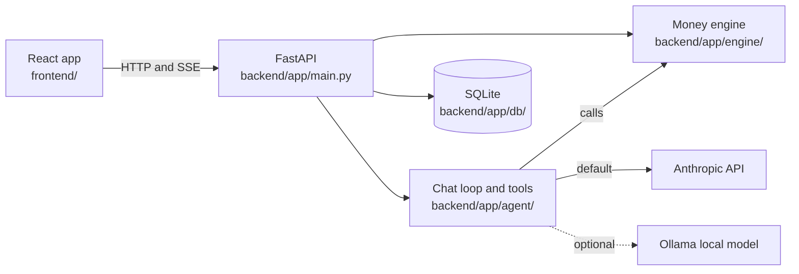

# codelinc11: Dental Benefits Copilot

An assistant for people with employer dental insurance. It answers three questions in plain language: **What will this procedure cost me? When should I schedule my care to pay the least? What do I still have left this year?** Built for the codeLinc 11 hackathon (Path 1, dental) by a five-person team using a team of AI coding agents.

> **Status (2026-10-03):** the full product works end to end and is ready for the 2026-10-04 demo: landing page, demo sign-in, six connected pages, a per-person household database, and an AI assistant on Anthropic that calls the money engine through tools.
> All plan, fee and member data is **synthetic**. Nothing here is a real plan or a real person.

## What it does

| Page | What you can do |
|---|---|
| **Landing** (`/welcome`) | What the product is, with a worked crown example |
| **Sign in** (`/login`) | Pick a demo account: Jordan (primary account holder), Alex (adult), Noah (adult, waiting for approval). Maya (9) has no login |
| **Home** | What is left this plan year, deductible, cleanings used, a "use it before it resets" banner, log a visit, calendar reminders |
| **Plans** | Compare Basic, Preferred and Premium side by side; the primary can switch the family plan |
| **Family** | Household tree; tap a person to see their own maximum, deductible and what they can use |
| **Costs** | Estimate a procedure in or out of network with "show the math", read a pasted dentist quote, yearly cost for a plan |
| **Plan My Year** | Add treatments and get the cheapest order across two plan years; urgent care never moves; save plans; ways to save; questions for your dentist |
| **Assistant** | Ask in plain words (typed or by voice); answers come from that person's own data and the engine |

Each person in the household has their own usage, history, saved plans and assistant memory. The primary account holder sees everyone; an adult sees only themselves.

## How it is built
The **engine does the math and the AI explains it**. Every dollar figure comes from `backend/app/engine/`. The language model never calculates a dollar amount, and a number guard in `backend/app/agent/guard.py` checks that figures in an answer came from a tool result.



More: [docs/ARCHITECTURE.md](docs/ARCHITECTURE.md).

## Tech stack
- **Frontend:** React 19, Vite, TypeScript, Tailwind CSS 4, shadcn/ui, React Router, TanStack Query, Recharts, Vitest and Testing Library.
- **Backend:** Python 3.11+, FastAPI, Pydantic v2, pytest, ruff.
- **Data:** SQLite (money stored as whole cents), JSON files for plans and procedure fees.
- **AI:** Anthropic (`claude-haiku-4-5`, default) with tool calling; Ollama as an optional local model. Voice input via the browser's speech recognition.

## Quick start
Full steps and troubleshooting: [docs/SETUP.md](docs/SETUP.md).

```
# Backend (from backend/)
python -m venv .venv
.venv/Scripts/python -m pip install -r requirements.txt     # Windows; on Mac/Linux use .venv/bin/python
.venv/Scripts/python -m app.db --reset                      # demo household
.venv/Scripts/python -m uvicorn app.main:app --port 8000      # copy .env.example to backend/.env and add ANTHROPIC_API_KEY first

# Frontend (from frontend/)
npm install
npm run dev                                                 # http://localhost:5173/welcome
```

## Tests (verified 2026-10-03)
| Suite | Command | Result |
|---|---|---|
| Backend (engine, API, auth and access rules, database, assistant) | `cd backend && .venv/Scripts/python -m pytest -q` | 262 passed |
| Backend lint | `cd backend && .venv/Scripts/python -m ruff check .` | clean |
| Frontend (pages, session, switcher, API clients) | `cd frontend && npm run test` | 75 passed |
| Frontend types and build | `npm run typecheck && npm run build` | clean |
| Browser end-to-end | `tests/` | not written yet |

The **golden numbers** (cleaning $0, crown in a fresh year $625, crown late in the year $800, out-of-network crown $925 with $300 balance billing, Plan My Year $2,300 to $1,405 saving $895) are checked exactly in `backend/tests/test_engine.py`. See [docs/MATH.md](docs/MATH.md).

## What was built and how
- A tested money engine with a calculation trace for every estimate, an exhaustive-search scheduler, and randomized property tests (`backend/tests/test_engine_props.py`).
- A household data model (households, members, roles, per-person usage, visits, saved plans and assistant memory) with access rules: the primary account holder sees everyone, an adult sees only their own data, a child under 18 has no login. Enforced in the API with signed session tokens (403 for someone else's data, 401 for chat without sign-in).
- An assistant that never does math: the model calls engine tools, and a number guard checks every dollar figure in its answer came from a tool result.
- Four hackathon prototypes were merged into one product. Each prototype branch is preserved untouched ([docs/prototypes/](docs/prototypes/README.md)).
- The work is run as a multi-agent build: one orchestrator plans, role agents (design, frontend, backend, database, AI, tests, docs) each edit only their own folders, and every result is checked by running the tests. Rules: [agents/README.md](agents/README.md). Story: [docs/PROJECT-STORY.md](docs/PROJECT-STORY.md).

## Team
Caleb Abrantes (engine, API and the dental prototype), Wrigley Taylor (personalized chatbot prototype), Sai (benefits portal prototype), Ulisses Molina-Becerra (navigation shell, theme and the sign-in page), and a design lead. Listed without ranking.

## Limitations
- Plan values, fees and members are placeholders or fictional (decision D7 is open).
- Estimates only. Every result says: "This is an estimate. Your actual cost depends on your dentist's charges and claim review."
- Sign-in is a demo "choose your account" screen, not real passwords (decision F1).
- Using the Anthropic provider sends chat text to a third party, so the demo uses synthetic data and sample documents only (decision F5).

## Repository layout

| Folder | What it holds |
|---|---|
| `frontend/` | The React app: pages, components, state, tests |
| `backend/` | FastAPI app: money engine, API, AI assistant, tests ([README](backend/README.md)) |
| `database/` | Schema, migrations, synthetic seed data |
| `tests/` | End-to-end and contract folders (empty for now) |
| `docs/` | All documentation ([index](docs/README.md)); early planning docs are in `docs/planning/` |
| `agents/` | Role briefs and task briefs for the AI agent team |
| `infra/`, `scripts/` and `.github/` | Run notes, one-command dev scripts, CI workflow (`ci.yml`, not yet run on GitHub) |

## More
[docs/FEATURES.md](docs/FEATURES.md) (features and golden numbers) · [docs/DEMO.md](docs/DEMO.md) · [docs/PRESENTATION.md](docs/PRESENTATION.md) · [docs/CONVENTIONS.md](docs/CONVENTIONS.md) · [docs/GIT-WORKFLOW.md](docs/GIT-WORKFLOW.md)

Screenshots to capture for this README (not yet added): landing hero, Home for Jordan, Family tree, Plan My Year savings card for Alex ($2,300 to $1,405), Costs crown out of network, Assistant answer.

All figures are estimates, not guarantees.
