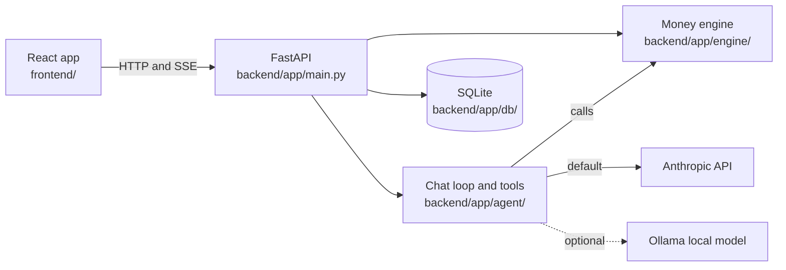

# Molar Money: Dental Benefits Copilot

An assistant for people with employer dental insurance. It answers three questions in plain language: **What will this procedure cost me? When should I schedule my care to pay the least? What do I still have left this year?** Built for the codeLinc 11 hackathon (Path 1, dental) by a five-person team using a team of AI coding agents.

> **Status (2026-10-03):** the full product works end to end and is ready for the 2026-10-04 demo: landing page, one-tap demo sign-in where every visitor gets their own demo family, six connected pages, a per-person household database, and an AI assistant on Anthropic that calls the money engine through tools. This work is on branch `feature/choose-a-plan`, which is **not pushed or merged yet**; `main` is what is in production.
> All plan, fee and member data is **synthetic**. Nothing here is a real plan or a real person.

## What it does

| Page | What you can do |
|---|---|
| **Landing** (`/welcome`) | What Molar Money is, with a worked crown example and a one-tap **Try the demo** button |
| **Scan to try** (`/join`) | A big QR code page for a screen or projector; phones scan it and land on `/welcome` |
| **Sign in** (`/login`) | **Try the demo** creates your own copy of the demo family. Then pick Jordan (primary account holder), Alex (adult) or Noah (adult, waiting for approval). Maya (9) has no login |
| **Home** | What is left this plan year, deductible, cleanings used, a "use it before it resets" banner, log a visit, calendar reminders, a **Notifications** card, a one-time **Name your family** card (primary only) |
| **Plans** | Compare Basic, Preferred and Premium side by side; **Which plan fits us?** simulates 5,000 possible years for your household and shows how often each plan is cheapest (synthetic odds) and can save a comparison to Plan My Year; the primary can switch the family plan |
| **Family** | Household tree; tap a person to see their own maximum, deductible and what they can use; edit profiles (date of birth, email, text number, ZIP), add and remove family members |
| **Costs** | Estimate a procedure in or out of network with "show the math", read a pasted dentist quote, yearly cost for a plan |
| **Plan My Year** | Add treatments and get the cheapest order across two plan years; urgent care never moves; save plans and saved plan comparisons; ways to save; questions for your dentist (a plain list) |
| **Assistant** | Ask in plain words (typed or by voice); answers come from that person's own data and the engine |
| **Notifications** (bell, top right) | Upcoming appointments and pending alerts for the person you are viewing; a full page with filters and settings for app, email and text. Email and text are previews only: nothing is ever sent in the demo |

Each person in the household has their own usage, history, saved plans and assistant memory. The primary account holder sees everyone; an adult sees only themselves.

**Every visitor gets their own demo family.** "Try the demo" (`POST /auth/demo-login` with `sandbox: true`) clones the demo Rivera household into a private copy that lasts 24 hours (at most 300 at once, about 4.4 KB each). Changes, resets and renames stay inside that copy, so one visitor cannot change another's demo. The primary can rename the family with **Name your family** (`PUT /households/{id}/names`, demo copies only). **Reset demo data** restores only your own copy.

**Phones.** The app works at 375 px: pages load on demand (the first JavaScript download is about 162 kB gzip), inputs are 16 px, tap targets are 44 px, the assistant is a full-screen panel, and there is a web manifest and icons for "Add to Home Screen". Show the QR code at `/join` (or make one with `scripts/make_qr.py`). Three ways to get phones onto it (same Wi-Fi, tunnel, public hosting) are in [docs/DEMO-PHONES.md](docs/DEMO-PHONES.md).

## How it is built
The **engine does the math and the AI explains it**. Every dollar figure comes from `backend/app/engine/`. The language model never calculates a dollar amount, and a number guard in `backend/app/agent/guard.py` checks that figures in an answer came from a tool result.



More: [docs/ARCHITECTURE.md](docs/ARCHITECTURE.md).

## Tech stack
- **Frontend:** React 19, Vite, TypeScript, Tailwind CSS 4, shadcn/ui, React Router, TanStack Query, Recharts, Vitest and Testing Library.
- **Backend:** Python 3.11+, FastAPI, Pydantic v2, pytest, ruff.
- **Data:** SQLite (money stored as whole cents), JSON files for plans and procedure fees.
- **AI:** Anthropic (`claude-haiku-4-5`, default) with tool calling; Ollama as an optional local model. Voice input via the browser's speech recognition.

## Quick start
Full steps and troubleshooting: [docs/SETUP.md](docs/SETUP.md).

```
# Backend (from backend/)
python -m venv .venv
.venv/Scripts/python -m pip install -r requirements.txt     # Windows; on Mac/Linux use .venv/bin/python
.venv/Scripts/python -m app.db --reset                      # demo household
.venv/Scripts/python -m uvicorn app.main:app --port 8000      # copy .env.example to backend/.env and add ANTHROPIC_API_KEY first

# Frontend (from frontend/)
npm install
npm run dev                                                 # http://localhost:5173/welcome
npm run dev:lan                                             # same, but reachable from phones on your Wi-Fi
```

**Scan to try:** open `http://localhost:5173/join` on a big screen; phones scan the code and open the landing page. For phones on the same Wi-Fi, a tunnel, or public hosting, see [docs/DEMO-PHONES.md](docs/DEMO-PHONES.md).

## Tests (verified 2026-10-03)
| Suite | Command | Result |
|---|---|---|
| Backend (engine, API, auth and access rules, database, assistant, sandboxes, rate limits) | `cd backend && .venv/Scripts/python -m pytest -q` | 633 passed |
| Backend lint | `cd backend && .venv/Scripts/python -m ruff check .` | clean |
| Frontend (pages, session, demo family, switcher, notifications, API clients; 23 test files) | `cd frontend && npm run test` | 240 tests |
| Frontend types and build | `npm run typecheck && npm run build` | clean |
| Browser end-to-end | `tests/` | not written yet (the demo flow is covered at the API level) |

The **golden numbers** (cleaning $0, crown in a fresh year $625, crown late in the year $800, out-of-network crown $925 with $300 balance billing, Plan My Year $2,300 to $1,405 saving $895) are checked exactly in `backend/tests/test_engine.py`. See [docs/MATH.md](docs/MATH.md).

## What was built and how
- A tested money engine with a calculation trace for every estimate, an exhaustive-search scheduler, and randomized property tests (`backend/tests/test_engine_props.py`), and a Monte Carlo plan comparison (`backend/app/engine/simulate.py`, `POST /simulate`, assistant tool `compare_plans`) that prices the same simulated years under every plan with that same engine. The odds behind it are synthetic placeholders. A comparison can be saved to Plan My Year; the server recomputes the summary, so a saved result cannot be forged.
- A household data model (households, members, roles, per-person usage, visits, saved plans and assistant memory) with access rules: the primary account holder sees everyone, an adult sees only their own data, a child under 18 has no login. Enforced in the API with signed session tokens (403 for someone else's data, 401 for chat without sign-in).
- Per-visitor demo sandboxes (the demo family cloned with suffixed ids, 24 hour expiry, cap of 300) so one person cannot spoil a shared demo, and in-memory rate limits (`backend/app/ratelimit.py`) that protect the Anthropic key: HTTP 429 with `Retry-After`.
- An assistant that never does math: the model calls engine tools, and a number guard checks every dollar figure in its answer came from a tool result.
- 36 API routes, 14 database tables over four migrations, 17 frontend test files, and a CloudFormation kit for AWS in `infra/aws/` (a reference only; it has not been run in AWS).
- Four hackathon prototypes were merged into one product. Each prototype branch is preserved untouched ([docs/prototypes/](docs/prototypes/README.md)).
- The work is run as a multi-agent build: one orchestrator plans, role agents (design, frontend, backend, database, AI, tests, docs) each edit only their own folders, and every result is checked by running the tests. Rules: [agents/README.md](agents/README.md). Story: [docs/PROJECT-STORY.md](docs/PROJECT-STORY.md).

## Team
Built by a five-person team (listed in the order given, without ranking):

- Marc Halog
- Sai Sarva
- Caleb Abrantes
- Wrigley Taylor
- Ulisses Molina-Becerra

## Limitations
- Plan values, fees and members are placeholders or fictional (decision D7 is open).
- Estimates only. Every result says: "This is an estimate. Your actual cost depends on your dentist's charges and claim review."
- Sign-in is a demo "choose your account" screen with no passwords (decision F1). Anyone with the link can start a demo family. An access code before a visitor can start a demo is an idea only; it is **not built**.
- The odds in "Which plan fits us?" are synthetic stand-ins, not claims data.
- Rate limits are counted in memory, per server process, and reset when the server restarts. Everything runs on one server with one SQLite file.
- Deployment: `main` is the production version. The backend runs on AWS and the frontend on Netlify (settings and the after-release checklist: [docs/DEPLOYMENT.md](docs/DEPLOYMENT.md)). A change merged to `main` reaches the live site; the backend is redeployed by a teammate. `infra/aws/` is only a reference kit.
- Using the Anthropic provider sends chat text to a third party, so the demo uses synthetic data and sample documents only (decision F5).

## Repository layout

| Folder | What it holds |
|---|---|
| `frontend/` | The React app: pages, components, state, tests |
| `backend/` | FastAPI app: money engine, API, AI assistant, tests ([README](backend/README.md)) |
| `database/` | Schema, migrations, synthetic seed data |
| `tests/` | End-to-end and contract folders (no test files yet; see [tests/README.md](tests/README.md)) |
| `docs/` | All documentation ([index](docs/README.md)); early planning docs are in `docs/planning/` |
| `agents/` | Role briefs and task briefs for the AI agent team |
| `infra/`, `scripts/` and `.github/` | AWS CloudFormation kit and runbook (not run), dev scripts, phone address and QR scripts, CI workflow (`ci.yml`, not yet run on GitHub) |

## More
[docs/FEATURES.md](docs/FEATURES.md) (features and golden numbers) · [docs/DEMO.md](docs/DEMO.md) · [docs/DEMO-PHONES.md](docs/DEMO-PHONES.md) · [docs/PRESENTATION.md](docs/PRESENTATION.md) · [docs/CONVENTIONS.md](docs/CONVENTIONS.md) · [docs/GIT-WORKFLOW.md](docs/GIT-WORKFLOW.md)

Screenshots to capture for this README (add them from the live site): landing hero with Try the demo, Scan to try page, Home for Jordan, Family tree, Plan My Year savings card for Alex ($2,300 to $1,405), Costs crown out of network, Assistant answer.

All figures are estimates, not guarantees.
