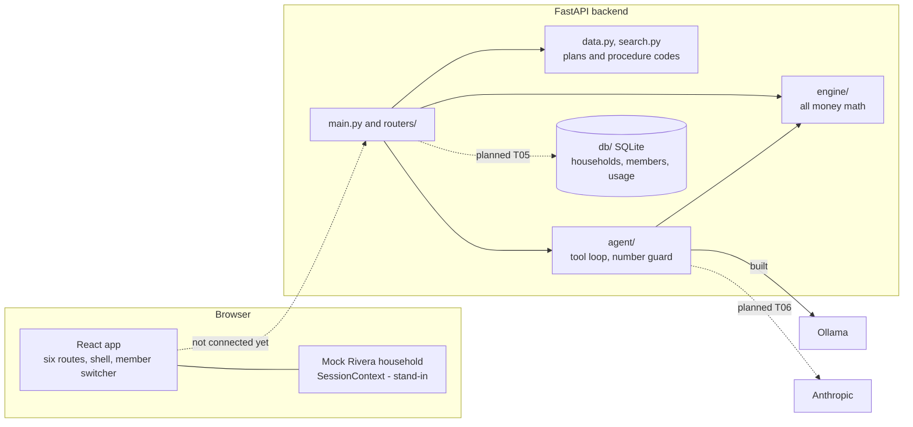

# ARCHITECTURE

How the pieces fit. Status is marked for each part: **built**, **planned** or **stand-in**. Checked against the code on 2026-10-03.

## System diagram

Today the frontend and backend run separately and **do not talk to each other**. The frontend reads a mock household; the database is not used by the API. T05 (household API) and the page tasks T07 to T12 connect them.

## Data flow

**An estimate** (built in the backend): `POST /estimate` with a procedure code, a plan (id or inline) and usage -> `load_catalog()` finds the procedure -> `engine/estimate.py` applies frequency limit, deductible, coinsurance and the yearly maximum, in and out of network -> response holds both results with a `trace` of plain-English steps.

**A plan-year run** (built in the backend): `POST /schedule` with treatments (code, urgency, optional "after") -> `engine/sequencer.py` tries every "this year or next year" split (up to 10 treatments), orders each year, runs it through `engine/annual.py` -> returns the schedule, yearly totals, the "everything now" baseline, savings and reasons.

**A chat message** (built with Ollama only): `POST /chat` -> `agent/loop.py` builds the system prompt and asks the model, which may call tools (`find_procedure`, `estimate_cost`, `plan_year_schedule`, `get_benefits_status`) that run engine code -> `agent/guard.py` checks every dollar figure in the answer came from a tool result -> the answer streams back as server-sent events (`tool_start`, `tool_end`, `token`, `done`, `error`). With no model, the answer says it is unavailable.

**Planned:** signed-in member -> household API reads that member's data from SQLite -> the same engine calls, with that person's usage -> the assistant gets only that member's context.

## API endpoints (as of 2026-10-03)

| Method and path | Purpose | Status |
|---|---|---|
| `GET /health` | Server up, whether Ollama is reachable, `chat_mode` | built |
| `GET /plans`, `GET /plans/{plan_id}` | Three tiers: `basic`, `preferred`, `premium` | built |
| `GET /procedures?q=` | Search procedure codes by plain words | built |
| `POST /estimate` | Cost of one procedure, in and out of network, with trace | built |
| `POST /schedule` | Plan My Year | built |
| `POST /benefits-status` | What is left in the plan year, reminder | built |
| `GET /reminders.ics` | Calendar file for an end-of-year reminder | built |
| `POST /savings-tips` | Tips, each with numbers from the engine | built |
| `POST /questions` | Questions to ask your dentist | built |
| `POST /treatment-plan/parse` | Read pasted dentist-quote text into treatments | built |
| `POST /chat` | Streamed assistant answer (SSE) | built (Ollama only) |
| `GET /auth/demo-accounts`, `POST /auth/demo-login` | Demo sign-in | planned (T05) |
| `GET /households/{id}`, `GET /members/{id}/overview`, `GET /members/{id}/schedule`, `POST /households/{id}/invites` | Household data | planned (T05) |
| `POST /annual-cost` | Yearly cost for a tier | planned (T05) |
| `GET /chat/suggestions`, `POST /chat/attachments` | Suggested questions, PDF upload | planned (T06) |

Plan: [../agents/tasks/PLAN.md](../agents/tasks/PLAN.md). The API contract is `backend/app/models.py`.

## Folder map

| Path | What is there |
|---|---|
| `backend/app/main.py` | FastAPI app, core routes, CORS, SSE |
| `backend/app/routers/` | `questions.py`, `tips.py`, `treatment_plan.py` |
| `backend/app/engine/` | `estimate.py`, `annual.py`, `sequencer.py`, `status.py`, `tips.py` |
| `backend/app/models.py` | Request and response models (the API contract) |
| `backend/app/data.py`, `search.py` | Load plans and codes; word search over procedures |
| `backend/app/questions.py`, `treatment_parser.py` | Dentist questions; quote parser |
| `backend/app/agent/` | `loop.py`, `tools.py`, `guard.py`, `ollama_client.py` |
| `backend/app/rag/` | Empty placeholder |
| `backend/app/db/` | `core.py`, `store.py`, `__main__.py` (SQLite access layer) |
| `backend/data/` | `plans/{basic,preferred,premium}.json`, `cdt_codes.json` (16 procedures), `plan_docs/` (empty) |
| `backend/tests/` | 148 tests |
| `database/` | `migrations/001_households.sql`, `seeds/demo_household.json` |
| `frontend/src/pages/` | Six page folders (`Home`, `Plans`, `Family`, `Costs`, `PlanYear`, `Assistant`), `StyleGuide.tsx`, and old unrouted prototype pages |
| `frontend/src/components/shell/` | Utility bar, nav, member switcher, assistant button, footer |
| `frontend/src/state/SessionContext.tsx` | Session and mock household |
| `frontend/src/index.css` | Portal design tokens |
| `tests/` | End-to-end, contract, fixtures (empty) |
| `docs/` | Documentation |
| `agents/` | Agent role and task briefs |

## Key rules
- All money math is in `backend/app/engine/`. The frontend and the model only display numbers.
- Per-person data: one person's context is never returned under another person's id (`backend/app/db/store.py`, tested).
- Plans, fees and members are synthetic.
