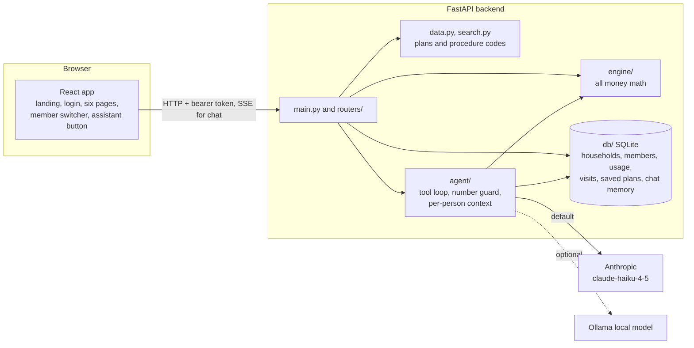

# ARCHITECTURE

How the pieces fit. Everything below is built and connected; checked against the code and the running app on 2026-10-03.

## System diagram

## Data flow

**Sign-in:** `/login` lists `GET /auth/demo-accounts`; tapping one calls `POST /auth/demo-login`, which returns a signed session token (lifetime `SESSION_TTL_HOURS`, default 12). Every household and chat call sends it as `Authorization: Bearer`. The primary account holder sees everyone; an adult sees only themselves; children have no login and are managed by a parent. Another person's data returns 403; chat without a token returns 401.

**A member's numbers:** `GET /members/{id}/overview` reads that person's usage from SQLite and runs the engine (`engine/status.py`) for what is left. `POST /members/{id}/visits` saves a visit and every page updates.

**An estimate:** `POST /estimate` with a procedure code, a plan (id or inline) and usage -> `engine/estimate.py` applies frequency limit, deductible, coinsurance and the yearly maximum, in and out of network -> both results with a `trace` of plain-English steps.

**A plan-year run:** `POST /schedule` with treatments (code, urgency, optional "after") -> `engine/sequencer.py` tries every "this year or next year" split (up to 10 treatments), orders each year, runs it through `engine/annual.py` -> schedule, yearly totals, the "everything now" baseline, savings and reasons. Plans can be saved per person (`/members/{id}/saved-plans`).

**A chat message:** `POST /chat` with `member_id` -> `agent/context.py` loads only that person's data -> `agent/loop.py` asks the model, which calls engine tools (`find_procedure`, `estimate_cost`, `plan_year_schedule`, `get_benefits_status`, `get_member_eligibility`, `get_household_coverage`, `get_savings_tips`, `get_dentist_questions`), at most 5 steps -> `agent/guard.py` checks every dollar figure came from a tool result -> the answer streams back as server-sent events (`tool_start`, `tool_end`, `token`, `done`, `error`). With no model, the answer says it is unavailable. Details: [AI.md](AI.md).

## API endpoints

| Method and path | Purpose |
|---|---|
| `GET /health` | Server up, `chat_mode` (`anthropic`, `ollama` or `unavailable`) |
| `GET /auth/demo-accounts`, `POST /auth/demo-login` | Demo sign-in |
| `GET /households/{id}` | Household and members (what the viewer may see) |
| `PUT /households/{id}/plan` | Primary switches the family plan |
| `POST /households/{id}/invites` | Invite an adult to their own account |
| `GET /members/{id}/overview`, `GET /members/{id}/schedule` | One person's numbers and booked care |
| `POST /members/{id}/visits` | Save a visit |
| `GET/POST /members/{id}/saved-plans`, `PUT/DELETE /members/{id}/saved-plans/{plan_id}` | Saved Plan My Year plans |
| `POST /demo/reset` | Rebuild the demo data (primary only) |
| `GET /plans`, `GET /plans/{plan_id}` | Three tiers: `basic`, `preferred`, `premium` |
| `GET /procedures?q=` | Search procedure codes by plain words |
| `POST /estimate` | Cost of one procedure, in and out of network, with trace |
| `POST /schedule` | Plan My Year |
| `POST /annual-cost` | Yearly cost for a tier |
| `POST /benefits-status`, `GET /reminders.ics` | What is left; calendar reminder |
| `POST /savings-tips`, `POST /questions` | Ways to save; questions to ask your dentist |
| `POST /treatment-plan/parse` | Read pasted dentist-quote text into treatments |
| `POST /chat`, `GET /chat/suggestions`, `POST /chat/attachments`, `GET /members/{id}/assistant-context` | Assistant (streamed), suggested questions, PDF upload, context |

The API contract is `backend/app/models.py`. Live docs: http://localhost:8000/docs.

## Folder map

| Path | What is there |
|---|---|
| `backend/app/main.py` | FastAPI app, core routes, CORS |
| `backend/app/routers/` | `auth`, `households`, `members`, `saved_plans`, `annual_cost`, `chat`, `session`, `tips`, `questions`, `treatment_plan` |
| `backend/app/engine/` | `estimate.py`, `annual.py`, `sequencer.py`, `status.py`, `tips.py` |
| `backend/app/agent/` | `providers.py` (Anthropic, Ollama), `loop.py`, `tools.py`, `guard.py`, `context.py`, `suggestions.py` |
| `backend/app/db/` | `core.py`, `store.py`, `__main__.py` (SQLite access layer, `python -m app.db --reset`) |
| `backend/data/` | `plans/{basic,preferred,premium}.json`, `cdt_codes.json` |
| `backend/tests/` | 262 tests |
| `database/` | `migrations/`, `seeds/demo_household.json` |
| `frontend/src/pages/` | `Landing.tsx`, `Login/`, `Home/`, `Plans/`, `Family/`, `Costs/`, `PlanYear/`, `Assistant/`, `StyleGuide.tsx` |
| `frontend/src/features/` | Page building blocks: `home`, `plans`, `family`, `costs`, `planYear`, `assistant` |
| `frontend/src/components/` | `shell/` (top bar, nav, switcher, assistant button), `landing/`, `auth/`, `ui/` |
| `frontend/src/state/SessionContext.tsx` | Signed-in session, viewed member, household |
| `frontend/src/index.css` | Portal design tokens (landing keeps its own scoped `.landing` look) |
| `tests/` | End-to-end and contract folders (empty; see TASKS.md) |

## Key rules
- All money math is in `backend/app/engine/`. The frontend and the model only display numbers.
- Per-person data: one person's context is never returned under another person's id (`backend/app/db/store.py`, tested).
- Plans, fees and members are synthetic.
