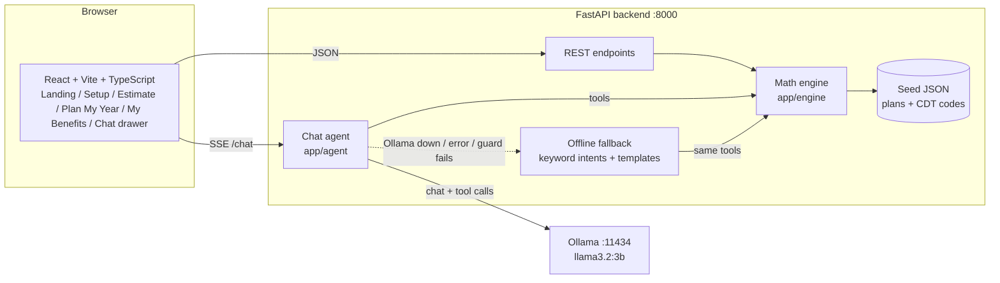

# PROTOTYPE.md: Guide to the Dental Benefits Prototype

Lincoln Financial codeLinc 11, Path 1. Branch: `proto/dental-prototype`. The build contract is [PROTOTYPE-SPEC.md](PROTOTYPE-SPEC.md); this page is the friendly tour. Team plan and golden numbers: [FEATURES.md](FEATURES.md). Git rules: [GIT-WORKFLOW.md](GIT-WORKFLOW.md).

## 1. What it does

Tagline: **Know what you'll owe before you sit in the chair.**

| Feature | What the user gets |
|---|---|
| **Estimate** | Type a procedure ("crown"), see what the plan pays and what you pay, in-network vs out-of-network side by side, with a "Show the math" step list. |
| **Plan My Year** | Add several treatments, press Optimize. The app tries every way to split them across this plan year and next, and shows the cheapest schedule month by month, with the savings. |
| **My Benefits** | Remaining annual max and deductible, cleanings used (e.g. 1 of 2), a use-it-or-lose-it reminder, and an **Add to calendar** (.ics) link. |
| **Dentist Quote** | Paste the text of a dentist's treatment plan. A rules parser (works with no Ollama) finds CDT codes, names, tooth numbers, fees and phase/urgency, and links a crown after a root canal on the same tooth. Unmatched lines are listed, never dropped. Shows quoted vs typical price bars and flags quotes above typical. "Optimize my year with these" hands the treatments to Plan My Year. |
| **Questions to ask your dentist** | Tickable checklist (progress, Copy list, Print), always starting with a safety note and "Is it urgent?". Plan-aware and procedure-specific; fixed templates, no LLM. Shown on Estimate and Plan My Year. |
| **Savings tips** | Cards on Estimate and Plan My Year: timing, network, preventive, alternative, FSA/HSA, quote check. All math in `engine/tips.py`. |
| **Chatbot** | A drawer on every page. Asks "What will a crown cost me?" and answers using the same math engine. Works with a local LLM (Ollama) or, if that is missing, an offline mode. |

## 2. Dental benefits primer

| Term | Plain meaning |
|---|---|
| **Deductible** | What you pay yourself first each plan year before the plan starts sharing costs. Demo plan: $50, waived for preventive care. |
| **Coinsurance** | The split after the deductible. "80%" means the plan pays 80% and you pay 20%. Demo plan: preventive 100%, basic 80%, major 50%. |
| **Annual maximum** | The most the plan will pay in one plan year (demo: $1,500). After that, you pay everything. |
| **In-network** | Dentist has a contract with the plan and accepts the plan's price (the "allowed amount"). |
| **Out-of-network** | No contract. The plan still pays based on the in-network allowed amount, but the dentist may bill more; the difference is **balance billing** and you pay it. |
| **Plan year** | The 12 months the deductible and maximum cover. It resets (demo: January 1), so unused max is lost and you get a fresh one. This is why timing matters. |
| **Frequency limit** | Cap on how often something is covered (demo: 2 cleanings per plan year). |

## 3. Architecture



### The rules that keep numbers trustworthy

1. **The LLM never does the math.** All dollar amounts come from `backend/app/engine/`. The model can only call tools (`find_procedure`, `estimate_cost`, `plan_year_schedule`, `get_benefits_status`) that wrap the engine. Plan, usage and month come from the request, not from the model.
2. **The frontend never computes dollars.** It only displays API fields; `src/lib/format.ts` formats only.
3. **Number guard** (`app/agent/guard.py`): every `$` amount in the model's answer must match (within $1) a number returned by a tool. If any does not, the answer is thrown away and the deterministic template answer is used instead.
4. **Guaranteed fallback.** If Ollama is not running, times out, errors, or fails the guard, chat switches to offline mode: keyword intent matching, same tools, answers written from templates. The chat always works. The `done` event and `/health` report which mode is in use (`ollama` or `fallback`).

## 4. API

Base URL `http://localhost:8000`. CORS allows `http://localhost:5173`. Plan resolution: inline `plan` wins over `plan_id`; if neither, `demo_ppo`. Contract: `backend/app/models.py` (do not edit without the team's agreement).

| Method | Path | Purpose |
|---|---|---|
| GET | `/health` | Status, Ollama availability, model, chat mode |
| GET | `/plans` | List sample plans |
| GET | `/plans/{id}` | One plan (404 if unknown) |
| GET | `/procedures?q=` | Fuzzy procedure search (empty `q` returns all) |
| POST | `/estimate` | In-network and out-of-network estimate with trace |
| POST | `/schedule` | Plan My Year optimizer |
| POST | `/benefits-status` | Remaining max/deductible, frequency usage, reminder |
| GET | `/reminders.ics?plan_name=&max_remaining=&month=` | Calendar file with Dec 1 and Dec 15 reminders |
| POST | `/treatment-plan/parse` | Parse pasted dentist quote text (rules; optional Ollama assist) |
| POST | `/questions` | Questions to ask your dentist (templates) |
| POST | `/savings-tips` | Savings tips with before/after and steps |
| POST | `/chat` | Server-sent events: `tool_start`, `tool_end`, `token`, `done {mode}`, `error` |

## 5. Golden numbers and demo script

Demo plan `demo_ppo`: deductible $50 (waived for preventive), max $1,500, 100/80/50, 2 cleanings per year. These are the expected values in the backend tests; never change them to make code pass.

| ID | Situation | Result |
|---|---|---|
| G1 | Cleaning, fresh year | Plan pays $120, you pay $0 |
| G2 | Filling, fresh year | Deductible $50, plan pays $120, you pay $80 |
| G3 | Crown, $1,100 of max already used | Plan pays $400 (capped from $575), **you pay $800** |
| G4 | Crown, fresh year | Plan pays $575, **you pay $625** |
| G5 | Crown, out-of-network | Plan pays $575, you pay $925 ($300 balance billing) |
| G6 | 3rd cleaning in a year | Not covered, you pay $120 |
| S2 | Plan My Year, see below | $2,300 to $1,405, **save $895** |

**Demo script (about 3 minutes)**
1. Landing: click **Try the demo plan**.
2. Setup: set max used to $1,100, deductible met to $50, month = November (sliders and month strip).
3. **Estimate**: search "crown". Show $800 you pay now (G3). Explain: only $400 of the max is left. Point to "Show the math".
4. Same crown next plan year is $625 (G4): waiting saves $175.
5. **Plan My Year**: click **Load demo case** (root canal urgent, crown after it, two fillings), then **Optimize**. Baseline $2,300, optimized $1,405, **you save $895**. Root canal stays this year (urgent); crown and fillings move to January when the plan year resets. Toggle "Everything now / Optimized".
6. **My Benefits**: show remaining $400, cleanings 1 of 2, the reminder banner, **Add to calendar**.
7. **Dentist Quote**: click "Use a sample treatment plan", "Read my plan", then "Optimize my year with these" to jump to Plan My Year with the quote loaded; show a quote above typical (e.g. $1,600 for a crown is flagged $100 above the typical high) and the savings tips (timing $2,300 to $1,405 saves $895; single crown network tip $925 to $625 saves $300).
8. **Chat**: ask "What if I wait until January?" Show the AI mode badge; mention it still works offline.

### Savings tips caveats
Tips overlap (for example timing and network change the same dollars), so **never add their savings together**. "Preventive" is the value of free covered visits, not a cash saving. "FSA/HSA" uses an assumed tax rate (a slider) and is not tax advice. "Alternative" only applies if the dentist agrees the cheaper option is right (uses `Procedure.alternative_codes` and `Plan.alternate_benefit`).

## 6. Project layout

```
backend/
  app/
    main.py            FastAPI app and routes
    models.py          API contract (Pydantic)
    treatment_parser.py  dentist-quote text parser
    questions.py       question templates
    routers/           treatment_plan.py, questions.py, tips.py
    data.py            loads seed JSON
    search.py          procedure search
    engine/            estimate.py, annual.py, sequencer.py, status.py, tips.py  (ALL the money math)
    agent/             ollama_client.py, tools.py, loop.py, guard.py
    rag/               empty placeholder (planned)
  data/                plans/*.json (demo_ppo, basic_ppo), cdt_codes.json (16 procedures)
  tests/               pytest suites (118 tests)
frontend/
  src/lib/             types.ts (hand-written), api.ts, format.ts, chat.ts, nav.ts
  src/state/           PlanContext.tsx
  src/pages/           Landing, Setup, Estimate, PlanYear, Benefits, TreatmentPlan
  src/components/      shared components (Controls, ProcedureGrid, TreatmentBuilder, charts...); ui/ = shadcn
  (58 Vitest tests live beside the code and in src/test/)
docs/                  this guide, spec, features, conventions, git workflow
```


## 7. Prototype shortcuts vs planned next

| Prototype (now) | Planned next |
|---|---|
| 2 hand-made sample plans and 15 procedures in JSON | Real plan data from reference material; full CDT catalog |
| Fees are placeholder p50/p80 values | Real FAIR Health or regional fee data |
| User types plan numbers or picks a sample | Upload a plan PDF and extract values (planned; not built, no `extract.py` yet) |
| Procedure search is synonyms plus fuzzy matching | RAG over plan documents |
| Plan My Year brute-forces up to 10 items across 2 plan years | Smarter search, more years, family plans |
| State kept in the browser (`localStorage`); no accounts | Accounts and saved profiles |
| Local Ollama model, offline template fallback | Hosted model, evaluation set for answer quality |
| Frontend types written by hand (`src/lib/types.ts`) | Generated types from the OpenAPI schema |
| Quote input is pasted text only | Photo/PDF upload of a quote (planned) |
| No Compare Plans / Monte Carlo view, no deployment | Planned |

## 8. Known limitations

- Estimates only. Real cost depends on the dentist's charges and claim review. Every results screen says so.
- One plan at a time; no waiting periods, missing-tooth clauses, orthodontics lifetime max, or family deductibles.
- Frequency limits only for the codes listed in the plan; history is whatever the user enters.
- Small local models can be wrong or slow; that is why the number guard and fallback exist. Answers in Ollama mode may still be phrased oddly.
- The optimizer is capped at 10 treatments and plans only the current and next plan year.
- The app never advises delaying urgent care; urgent items always stay in this year.
- The real Ollama path is **not yet verified with a live model**: it was only tested with a fake client. On the dev machine (no Ollama installed) chat ran in offline mode ("AI: offline mode" badge).
- Scheduling rule: if an urgent treatment has an `after` prerequisite, the prerequisite is treated as urgent too (transitively), so both land in the current plan year, prerequisite first.

- **All prices and plan rules are placeholder data, not real.** Do not treat any number as a real quote or coverage decision.
- Quote data stays in the browser tab and is not saved; the Plan My Year hand-off (draft in `PlanContext`) is in memory only.

## 9. Status

Verified: 118 backend and 58 frontend tests pass; `npm run typecheck` and `npm run build` pass. Checked live in the browser: crown with fresh usage shows You pay $625 (plan pays $575); the Plan My Year demo case shows $2,300 to $1,405, save $895; chat "What will a crown cost me?" with $1,100 used answers $800 in-network and $1,100 out-of-network ($300 balance billing). Not built yet: photo/PDF upload of a quote, plan PDF extraction, Compare Plans / Monte Carlo, live-Ollama verification, deployment.

## 10. UI notes

The UI uses visual controls instead of native dropdowns: segmented controls, a month strip, sliders, visit chips, tappable procedure cards by category, and a treatment tray with a 3-way urgency control and "Must come after..." linking. Navigation is React state (no router).
