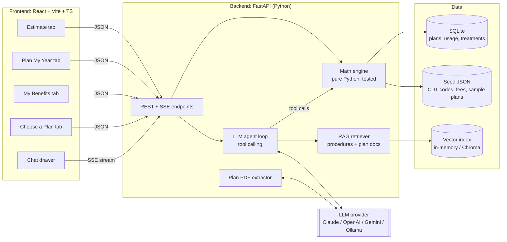

# Path 1 Deep Dive: Dental Benefits Optimizer

The architecture, backend, frontend, LLM/RAG agent and math engine for a Path 1 build at codeLinc 11.

> **About the numbers:** Plan values below (deductibles, maximums, coinsurance, fees) are realistic **placeholders**. Replace them with the real values from the challenge's dental reference site (tinyurl.com/codelinc11dental), the enrollment video, and FAIR Health lookups for a Greensboro ZIP code.

---

## 1. The product: one app, four tabs

Combine ideas 1A, 1B and 1C into one product with a shared plan model and one math engine, so the four tabs reuse the same code.

| Tab | What it does | Challenge item | Priority |
|---|---|---|---|
| **Estimate** | "I need a crown." → plain-English breakdown of what's covered and what you'll owe | Core 1 + 2, Extra 2 (in-network vs out-of-network) | **P0 (must have)** |
| **Plan My Year** | Treatment list → optimal schedule across plan years → "$ saved" | Core 3 | **P0** |
| **My Benefits** | Annual-max gauge, deductible progress, use-it-or-lose-it reminders | Extra 1 + 3 | **P1** |
| **Choose a Plan** | Monte Carlo comparison of plan options at enrollment | "Selection Process" | **P2 (stretch)** |

A **chat drawer** sits on every tab. The LLM agent can call the same engine functions, so "what if I wait until January for the crown?" works anywhere in the app.

---

## 2. Architecture



**The key design rule:** the **engine** computes every dollar amount. The **LLM** only (1) turns plain English into structured inputs, (2) retrieves plan facts, and (3) explains engine output. Each engine result comes with a **calculation trace** (the list of steps behind it), which the UI shows as "Show the math" and the LLM uses to write its explanation.

### Repository layout

```
codelinc11/
├── backend/
│   ├── app/
│   │   ├── main.py              # FastAPI app, routes
│   │   ├── models.py            # Pydantic: Plan, Procedure, Usage, TreatmentItem, Trace
│   │   ├── engine/
│   │   │   ├── estimate.py      # single-procedure cost math
│   │   │   ├── annual.py        # apply many procedures in order within a plan year
│   │   │   ├── sequencer.py     # Plan My Year optimizer
│   │   │   └── simulate.py      # Monte Carlo plan comparison
│   │   ├── agent/
│   │   │   ├── tools.py         # tool schemas -> engine functions
│   │   │   ├── loop.py          # tool-calling loop + streaming
│   │   │   ├── prompts.py
│   │   │   └── guard.py         # number validation
│   │   ├── rag/
│   │   │   ├── index.py         # build embeddings at startup
│   │   │   └── retrieve.py      # hybrid search
│   │   └── extract.py           # plan PDF -> Plan JSON
│   ├── data/
│   │   ├── cdt_codes.json       # ~30 procedures + lay synonyms
│   │   ├── fees_27401.json      # FAIR Health 50th/80th percentile, by code
│   │   └── plans/*.json         # 2–3 sample plans
│   └── tests/test_engine.py     # golden test cases (section 6)
└── frontend/
    └── src/
        ├── pages/  (Estimate, PlanYear, Benefits, ChoosePlan)
        ├── components/ (BreakdownCard, CostWaterfall, YearTimeline, MaxGauge, ChatDrawer, MathTrace)
        └── lib/api.ts
```

---

## 3. Data model

```python
# backend/app/models.py
from pydantic import BaseModel
from typing import Literal
from datetime import date

Category = Literal["preventive", "basic", "major", "ortho"]

class Plan(BaseModel):
    id: str
    name: str                                  # "Dental PPO High"
    monthly_premium: float                     # employee cost per month
    plan_year_start: date                      # usually Jan 1
    deductible: float                          # per person, per plan year
    deductible_waived_for: list[Category] = ["preventive"]
    annual_max: float                          # e.g. 1500
    coinsurance: dict[Category, float]         # plan's share: {"preventive":1.0,"basic":0.8,"major":0.5,"ortho":0.5}
    oon_coinsurance: dict[Category, float] | None = None
    waiting_months: dict[Category, int] = {}   # e.g. {"major": 12}
    frequency: dict[str, str] = {}             # {"D1110": "2/plan_year", "D2740": "1/5y/tooth"}
    ortho_lifetime_max: float | None = None

class Procedure(BaseModel):
    code: str                                  # "D2740"
    name: str                                  # "Crown - porcelain/ceramic"
    category: Category
    synonyms: list[str]                        # ["cap", "tooth cap", "crown"]
    fee_p50: float                             # FAIR Health 50th percentile (in-network proxy)
    fee_p80: float                             # 80th percentile (out-of-network billed proxy)

class Usage(BaseModel):                        # per member per plan year
    plan_year: int
    deductible_met: float = 0
    max_used: float = 0
    history: list[tuple[str, date]] = []       # (code, date) for frequency checks

class TreatmentItem(BaseModel):
    code: str
    tooth: str | None = None
    urgency: Literal["urgent", "soon", "flexible"] = "flexible"
    latest: date | None = None                 # clinical deadline
    after: str | None = None                   # dependency, e.g. crown after root canal

class TraceStep(BaseModel):
    label: str                                 # "Deductible applied"
    amount: float
    note: str                                  # "Basic and major services require the $50 deductible first"
```

### Seed data to collect (assign to one person; about 2 hours)

- **~30 CDT codes:** exams (D0120, D0150), X-rays (D0210, D0274), cleanings (D1110, D1120), fluoride, sealants, fillings (D2140, D2391, D2392), crowns (D2740, D2750), root canals (D3310, D3330), extractions (D7140, D7210), periodontal scaling (D4341), implants (D6010), dentures, night guard (D9944), ortho (D8080). Include 3–5 everyday synonyms for each.
- **Fees:** 50th and 80th percentile from FAIR Health for ZIP 27401.
- **2–3 plans** from the reference material, for example "Low PPO" ($1,000 max, 100/80/50) and "High PPO" ($2,000 max, 100/80/60, ortho included).

---

## 4. Math engine (the core of Path 1)

### 4.1 Single-procedure estimate

The usual order in which dental plans apply cost sharing:

1. **Allowed amount:** in-network uses the negotiated fee (our proxy is FAIR Health's 50th percentile). Out-of-network the plan pays from an allowed amount, but the dentist can bill more (proxy: 80th percentile). The difference is **balance billing**.
2. **Deductible:** applies to basic and major, usually waived for preventive.
3. **Coinsurance:** the plan pays its share of what's left.
4. **Annual maximum:** the plan stops paying once the yearly cap is reached.
5. **Patient pays** the rest, plus any balance billing.

```python
# backend/app/engine/estimate.py
def estimate(proc: Procedure, plan: Plan, usage: Usage, in_network: bool = True):
    trace = []
    allowed = proc.fee_p50
    billed = proc.fee_p50 if in_network else proc.fee_p80
    trace.append(TraceStep(label="Typical cost", amount=billed,
                           note=f"FAIR Health typical charge for {proc.name}"))

    # Deductible
    if proc.category in plan.deductible_waived_for:
        ded = 0.0
    else:
        ded = min(max(plan.deductible - usage.deductible_met, 0), allowed)
    trace.append(TraceStep(label="Deductible", amount=ded,
                           note="You pay this part first" if ded else "Waived for this service"))

    # Coinsurance
    rates = plan.coinsurance if in_network else (plan.oon_coinsurance or plan.coinsurance)
    rate = rates[proc.category]
    covered = (allowed - ded) * rate
    trace.append(TraceStep(label=f"Plan share ({rate:.0%})", amount=covered,
                           note=f"{proc.category.title()} services are covered at {rate:.0%}"))

    # Annual maximum
    remaining_max = max(plan.annual_max - usage.max_used, 0)
    plan_pays = min(covered, remaining_max)
    if plan_pays < covered:
        trace.append(TraceStep(label="Annual max limit", amount=covered - plan_pays,
                               note=f"Only ${remaining_max:,.0f} left in this year's maximum"))

    balance_bill = billed - allowed  # 0 when in network
    you_pay = billed - plan_pays
    return {"plan_pays": round(plan_pays, 2), "you_pay": round(you_pay, 2),
            "balance_bill": round(balance_bill, 2),
            "deductible_used": ded, "max_used": plan_pays, "trace": trace}
```

**Worked example (the one to use in the demo):**
Crown D2740, allowed $1,200. Plan: $50 deductible, major services at 50%, $1,500 annual max, and **$1,100 already used** this year.

| Step | This year (November) | Next plan year (January) |
|---|---|---|
| Deductible | $50 | $50 |
| Plan share 50% × $1,150 | $575 | $575 |
| Annual max left | **$400** → plan pays $400 | $1,500 → plan pays $575 |
| **You pay** | **$800** | **$625** |

**Waiting until January saves $175.** This is what the Plan My Year tab automates.

**Extra realism (optional, judges with insurance backgrounds will notice):**
- **Frequency limits:** "2 cleanings per plan year". Check against `usage.history` and return "not covered, limit reached".
- **Waiting periods:** major services aren't covered for the first 12 months of membership.
- **Alternate benefit:** a white (composite) filling on a back tooth is paid at the silver (amalgam) rate. Use a simple lookup table.

### 4.2 Annual engine (several procedures in one year)

```python
# backend/app/engine/annual.py
def run_year(items: list[Procedure], plan: Plan, start_usage: Usage):
    usage = start_usage.model_copy(deep=True)
    results = []
    for p in items:                      # order matters: deductible and max are used up in sequence
        r = estimate(p, plan, usage)
        usage.deductible_met += r["deductible_used"]
        usage.max_used += r["max_used"]
        results.append(r)
    return results, usage
```

The sequencer and the Monte Carlo simulation both reuse this function. **One engine, tested once.**

### 4.3 Plan My Year: the sequencer

**The problem:** Given treatment items, the current year's remaining benefits, and next year's fresh benefits, assign each item to *this plan year* or *next plan year* (and a month) to **minimize total out-of-pocket**, subject to:
- urgent items must happen now (don't let the app recommend delaying necessary care),
- dependencies (crown after root canal),
- clinical deadlines (`latest`),
- frequency and waiting-period rules.

**Approach A: exact brute force (recommended; it's simple and correct).**
A real treatment plan has at most about 10 items and 2–3 plan years, so 2¹⁰ = 1,024 combinations. Score every valid assignment with the exact `run_year` engine and keep the best. It runs in milliseconds and is provably optimal for this problem size.

```python
# backend/app/engine/sequencer.py
from itertools import product

def best_schedule(items, plan, usage_now, years=2):
    best = None
    for assign in product(range(years), repeat=len(items)):
        if not feasible(items, assign):          # urgency, dependencies, deadlines, waiting periods
            continue
        total_oop = 0
        for y in range(years):
            year_items = order_within_year([it for it, a in zip(items, assign) if a == y])
            start = usage_now if y == 0 else Usage(plan_year=usage_now.plan_year + y)
            res, _ = run_year(year_items, plan, start)
            total_oop += sum(r["you_pay"] for r in res)
        # small penalty per delayed item so equal-cost plans prefer doing care sooner
        score = total_oop + DELAY_PENALTY * sum(assign)
        if best is None or score < best[0]:
            best = (score, assign, total_oop)
    baseline = oop_if_all_now(items, plan, usage_now)
    return {"assignment": best[1], "oop": best[2], "savings": baseline - best[2]}
```

Inside each year, schedule in order of urgency, then dependencies, then put the most expensive items first (so they're covered before the max runs out). Pick months by spacing appointments (for example, one per month), with **December/January splits** when a treatment straddles the plan-year boundary.

**Approach B: integer program (good for the pitch, use if you have time).**
For more items or month-level detail, formulate it as a mixed-integer program in PuLP:

- Decision: $x_{i,m} \in \{0,1\}$ = item $i$ happens in month $m$; $y(m)$ = plan year of month $m$
- Each item scheduled once within its window: $\sum_m x_{i,m} = 1$
- Dependency: $\sum_m m\,x_{j,m} \ge \sum_m m\,x_{i,m} + 1$ (if $j$ must follow $i$)
- Deductible flag: $z_y \ge x_{i,m}$ for basic/major $i$, $m \in y$
- Plan payment per year: $b_y \le \sum_{i,m\in y} r_i c_i x_{i,m} - \bar r\, D\, z_y$ and $b_y \le M - U_y$
- Objective: $\max \sum_y b_y - \lambda \sum_{i,m} m\,x_{i,m}$

The deductible term is an approximation, so **always recompute the chosen schedule with the exact engine** before showing numbers.

**The demo moment:** "Your dentist recommended a root canal, a crown and two fillings. Doing everything now costs you $1,640. Our plan: the root canal and fillings in November, the crown on January 8. You pay $1,065, **a $575 saving**, with no medically urgent care delayed."

### 4.4 My Benefits: tracker and use-it-or-lose-it

- **Gauges:** annual max used vs remaining, deductible progress, cleanings used (for example, 1 of 2).
- **Use-it-or-lose-it value:** `unused_preventive_value = sum(fee of covered-but-unused preventive visits)`, plus the remaining annual max.
- **Reminder logic:** if the month is October or later and remaining max > $0 or a covered cleaning is unused, show a banner and offer a downloadable `.ics` file ("Book cleaning before Dec 31", with an alarm 2 weeks before). The `ics` Python package can generate it.
- **Optional:** log a visit manually, or upload an Explanation of Benefits (EOB) and let the extractor (section 5.4) update usage.

### 4.5 Choose a Plan: Monte Carlo (stretch)

Simulate a year of dental care for each plan option and compare **premiums + out-of-pocket**.

- **How many procedures happen:** Poisson count per category, with rates by user profile:

| Profile | Preventive visits/yr | Fillings/yr | Major/yr |
|---|---|---|---|
| Low risk | 2 | 0.2 | 0.05 |
| Average | 2 | 0.6 | 0.15 |
| High risk / known work needed | 2 | 1.5 | 0.6 + known items |

- **How much each costs:** lognormal around the FAIR Health 50th percentile (spread from the 50th–80th percentile gap).
- **Known planned work** (like "I need a crown") is added to every simulated year.

```python
# backend/app/engine/simulate.py
import numpy as np

def simulate(plans, profile, known_items, n=5000, seed=42):
    rng = np.random.default_rng(seed)
    out = {p.id: np.empty(n) for p in plans}
    for k in range(n):
        procs = sample_year(rng, profile) + known_items     # same simulated year for every plan
        for p in plans:
            res, _ = run_year(procs, p, Usage(plan_year=0))
            out[p.id][k] = 12 * p.monthly_premium + sum(r["you_pay"] for r in res)
    cheapest = np.argmin(np.stack([out[p.id] for p in plans]), axis=0)
    return {p.id: {"mean": out[p.id].mean(), "p10": np.percentile(out[p.id], 10),
                   "p90": np.percentile(out[p.id], 90),
                   "prob_cheapest": float((cheapest == i).mean())}
            for i, p in enumerate(plans)}
```

Using the **same simulated year for every plan** (common random numbers) makes the comparison fair and lowers noise.
**Output:** "The High PPO costs $210 more in premiums but is the cheapest choice in 71% of simulated years for you, because of your planned crown." Show overlapping histograms or box plots.

---

## 5. LLM / RAG agent

### 5.1 What the LLM does (and doesn't do)

| LLM does | Engine does |
|---|---|
| Plain English → procedure codes ("cap on my back tooth" → D2740) | All dollar amounts |
| Asks follow-up questions when the input is unclear ("front or back tooth?" changes root canal cost) | Deductible, coinsurance and max logic |
| Extracts plan details from PDFs | Scheduling and optimization |
| Answers "is X covered?" from plan documents, with citations | Monte Carlo simulation |
| Explains the engine's trace in friendly language | |

### 5.2 RAG: two small indexes

The corpus is tiny, so keep RAG simple: **build the index at startup, in memory.**

1. **Procedure index:** about 30 CDT entries, each embedded as `"{name}. Also called: {synonyms}. Category: {category}"`. Used to ground procedure matching so the LLM **chooses from real codes** instead of inventing them.
2. **Plan document index:** the benefits summary / booklet text (from the reference material or an uploaded PDF), split by section heading into chunks of about 300–500 tokens, with metadata `{plan_id, section, page}`.

**Retrieval:** hybrid search. Run a keyword search (BM25 via `rank_bm25`), which catches exact terms like "D2740" or "night guard", and an embedding cosine search, which catches lay wording like "cap on my tooth". Merge the results with reciprocal rank fusion and keep the top 5.

**Embeddings:** any provider's small embedding model, or a free local model (`sentence-transformers/all-MiniLM-L6-v2`). **Vector store:** a NumPy array is enough at this size; use Chroma if you want persistence.

### 5.3 Agent tools

```python
TOOLS = [
  {"name": "find_procedure",
   "description": "Search the procedure catalog with the user's words. Returns candidate CDT codes with names and categories.",
   "input": {"query": "str"}},
  {"name": "estimate_cost",
   "description": "Exact cost estimate for one procedure under the user's plan and current usage.",
   "input": {"code": "str", "in_network": "bool"}},
  {"name": "plan_year_schedule",
   "description": "Optimize when to do a list of treatments to minimize out-of-pocket cost.",
   "input": {"items": "list[TreatmentItem]"}},
  {"name": "get_benefits_status",
   "description": "Remaining annual max, deductible met, frequency limits used.",
   "input": {}},
  {"name": "search_plan_docs",
   "description": "Retrieve plan document passages to answer coverage questions. Cite the section.",
   "input": {"question": "str"}},
]
```

**Agent loop:** a plain tool-calling loop with your provider's SDK (send messages → if the model asks for a tool, run it and append the result → repeat, max 6 steps → stream the final answer to the browser over SSE). This is about 60 lines of code. A framework (LangGraph, Pydantic AI) is optional; for a hackathon, a plain loop is easier to debug.

### 5.4 Plan PDF extraction

1. Get text out of the PDF with `pdfplumber` (use `pymupdf` for tricky layouts).
2. Call the LLM with **structured output** constrained to the `Plan` Pydantic schema.
3. **Show the extracted plan to the user in an editable form to confirm.** Never trust extraction silently. Showing this step in the demo also reads as responsible design.

### 5.5 Prompts and guardrails

**System prompt (outline):**
- You help employees understand dental benefits. Plain language, roughly an 8th-grade reading level, warm and brief.
- **Never state a dollar amount that didn't come from a tool result.** If you need a number, call a tool.
- If the procedure is unclear, call `find_procedure` and ask the user to choose; don't guess.
- Never advise delaying care that is urgent or causing pain. Recommend talking to the dentist.
- Always end estimates with: "This is an estimate. Your actual cost depends on your dentist's charges and claim review."

**Number guard (`guard.py`):** after the final answer, extract every `$` amount with a regex and check that each one appears in that turn's tool outputs (to within $1, allowing for rounding). If any doesn't match, regenerate once with a correction note, or fall back to a template built from the trace. It's simple, and a strong story for judges at an insurance company.

**Low temperature** (0–0.3) for extraction and code matching. Slightly higher is fine for explanations.

---

## 6. Backend (FastAPI)

| Method | Endpoint | Purpose |
|---|---|---|
| GET | `/plans` | List sample plans |
| POST | `/plans/extract` | Upload PDF → draft `Plan` JSON |
| GET | `/procedures?q=` | Hybrid search of procedures (for autocomplete too) |
| POST | `/estimate` | `{plan_id, code, in_network, usage}` → breakdown + trace |
| POST | `/schedule` | `{plan_id, items[], usage}` → schedule, OOP, savings, baseline |
| GET/POST | `/usage` | Read or update benefits usage |
| GET | `/reminders.ics` | Calendar file for unused benefits |
| POST | `/simulate` | `{plan_ids[], profile, known_items[]}` → distribution stats |
| POST | `/chat` | Agent turn, streamed back over SSE |

- **Libraries:** `fastapi`, `uvicorn`, `pydantic`, `sqlmodel` (SQLite), `numpy`, `pulp` (optional), `pdfplumber`, `rank_bm25`, `sentence-transformers` (or provider embeddings), `ics`, and your LLM provider's SDK.
- **Session/state:** for the demo, one user is enough. Store usage in SQLite under a demo user ID, or keep it in the frontend and send it with each request (the simplest option).
- **Golden tests (`tests/test_engine.py`):** write these **first**, by hand on a whiteboard, then code until they pass.
  - preventive cleaning → deductible waived, 100%, you pay $0
  - first filling of the year → deductible applied
  - crown with $400 max left → capped (the $800 case above)
  - same crown in January → $625
  - out-of-network → balance billing shown
  - 3rd cleaning → frequency limit, not covered
  - sequencer: the example above saves $575, and an urgent item is never moved

---

## 7. Frontend (React + Vite + TypeScript)

**Libraries:** Tailwind CSS, shadcn/ui (cards, tabs, sliders, dialogs), TanStack Query (API calls and caching), Recharts (charts), `react-hook-form` + `zod` (plan form), `lucide-react` (icons).

### Screens

**1. Plan setup (onboarding)**
- Choose a sample plan, upload a plan PDF (with the editable confirmation form), or enter details by hand.
- Enter "already used this year" (max used, deductible met). Defaults to 0.

**2. Estimate**
- A big input: "What does your dentist say you need?" with procedure autocomplete from `/procedures`.
- A **BreakdownCard** with a big "You pay $X" and "Plan pays $Y", plus an in-network/out-of-network toggle that shows both side by side.
- A **CostWaterfall** chart: Typical cost → − Plan share → − (max limit) → You pay.
- A **MathTrace** accordion ("Show the math"), rendered straight from `trace`.
- A plain-English explanation from the LLM, and a jargon hover glossary (deductible, coinsurance, annual max, UCR, balance billing).

**3. Plan My Year**
- A treatment list builder: add procedures, mark urgency, set a dependency ("after root canal").
- A **YearTimeline**: months across the x-axis with a plan-year divider, and procedures as chips in their scheduled months. Below it, a stacked bar per year showing annual max used vs remaining.
- A **savings banner**: "Doing everything now: $1,640 → Optimized: $1,065 → **You save $575**."
- A toggle "Compare to doing everything now" that animates chips moving between the two schedules (a good demo moment).
- A "Why this order?" explanation from the LLM, based on the trace.

**4. My Benefits**
- A radial gauge for the annual max, a progress bar for the deductible, and cleanings used (for example, 1 of 2).
- An October-or-later banner: "You have $1,100 and 1 cleaning left. Book before Dec 31." with an **Add to calendar** button (`.ics`).

**5. Choose a Plan (stretch)**
- A profile selector, known planned work, and overlapping histograms or box plots per plan.
- "Cheapest in X% of years" cards and a recommended plan with its reasoning.

**Chat drawer (every page):** streams over SSE and shows tool use as small status chips ("Looking up procedure…", "Calculating…"), which makes the agent's work visible to judges.

**Design notes:** Lincoln's colors (maroon #6b0f2a, orange #f5591f) as accents, large dollar figures, plenty of white space, calm wording. Make sure it works at phone width; judges may open it on a phone.

---

## 8. Team plan and AI-agent workflow

**Team:** 1 applied math major (CS minor) + 4 CS majors. **AI tools:** 3 Claude Code seats, plus 1–2 seats of free Kiro and/or IBM Bob (these have small credit budgets, so save them for high-value work).

### 8.1 Who gets which tool

| Person | Role | Owns (folders) | AI tool | Why this pairing |
|---|---|---|---|---|
| **M: Applied math** | Math lead | `backend/app/engine/`, `backend/tests/` | **Kiro (spec mode)** | Spec-driven development fits the engine: requirements (the plan rules) → design (formulas) → tasks → code + tests. M checks the math, the agent writes the Python. The specs also serve as judging documentation. |
| **CS1** | Backend + integration, **merge captain** | `backend/app/main.py`, `models.py`, `extract.py`, deployment, CI | **Claude Code** | The most cross-cutting coding work: routes, schemas, PDF extraction, connecting everything |
| **CS2** | LLM/RAG agent | `backend/app/agent/`, `backend/app/rag/` | **Claude Code** | Tool loop, retrieval, prompts and the number guard: lots of iterative code |
| **CS3** | Frontend | `frontend/` | **Claude Code** | The largest amount of code: 5 screens, charts, chat drawer |
| **CS4** | Data, QA + pitch; second pair of hands on the engine | `backend/data/`, `docs/`, `README.md`, demo script | **IBM Bob** (Ask + Agent modes) | Ask mode to research insurance rules, Agent mode to write seed-data scripts and extra tests, review PRs, write the README. Pairs with M on the engine when the data is done. |

If you only get one Kiro/Bob seat, give it to **M** (Kiro). CS4 then works without an agent, or shares a Claude Code seat during off-shifts.

**Credit tip:** Kiro's free tier is 50 credits, and the student tier is 1,000/month after verification. Have M verify their student status at kiro.dev/students **right away**. Bob's trial has 50 coins. Use these tools for planning, specs and reviews, not for long autonomous runs.

### 8.2 Ground rules that keep 5 humans and 5 agents from colliding

1. **One repo, folder ownership.** Each person and their agent edits **only their own folders** (table above). Changes outside them go through the owner. This prevents nearly all merge conflicts.
2. **The API contract is shared and protected.** `backend/app/models.py` (Pydantic) is the single source of truth. Generate TypeScript types from FastAPI's OpenAPI schema with `openapi-typescript` into `frontend/src/lib/api-types.ts`. Only **CS1** changes the contract, after posting the change in Discord.
3. **Golden tests are written by hand, by M, first.** `backend/tests/test_engine.py` is the contract between the math and everyone else. **No agent may edit the golden tests** without M's approval. Put this rule in every agent's instruction file.
4. **Stubs first.** By 2:30 PM, CS1 ships every endpoint returning fixture JSON from `backend/fixtures/`. CS2 and CS3 build against the stubs and are never blocked waiting on the engine.
5. **Small PRs, often.** Merge to `main` every 60–90 minutes. **`main` must always run and be demoable.** CS1 merges. GitHub Actions runs `pytest`, `tsc --noEmit` and lint on every PR.
6. **One set of conventions for all agents.** Write `docs/CONVENTIONS.md` once (stack, folder ownership, "never compute dollar amounts in the LLM", "don't edit golden tests", code style, how to run tests). Then point every tool at it:
   - **Claude Code:** root `CLAUDE.md` containing `@docs/CONVENTIONS.md`, plus a short `frontend/CLAUDE.md` and `backend/CLAUDE.md` for area-specific commands.
   - **Kiro:** a steering file in `.kiro/steering/` that references the same doc.
   - **Bob:** paste the same conventions into its project rules / custom instructions.
7. **Secrets stay out of git.** API keys go in `.env` (in `.gitignore`), and a committed `.env.example` lists the variable names. Don't paste keys into agent chats.

### 8.3 How each person works with their agent

**Claude Code (CS1, CS2, CS3)**
- Start each feature in **plan mode**: have Claude read the relevant files and propose a plan, review it, then let it implement. Five minutes of planning saves an hour of wrong code.
- **One task per session.** Start a fresh session for each new feature so context stays focused. If you want two tasks running in parallel, use a separate **git worktree** for each so they don't overwrite each other.
- Ask Claude to **run the tests and the app itself** before you open a PR. Run a code review on your diff before merging.
- Commit after each working step, so a bad agent run is easy to undo with git.

**Kiro (M)**
- Spec mode for the engine. Write the requirements yourself, in your own words: deductible, coinsurance, annual max, frequency limits, the sequencer objective and constraints. Let Kiro generate the design and tasks, **check every formula**, then let it implement task by task.
- Use vibe mode only for quick experiments (for example, "plot the Monte Carlo distribution").
- Keep the spec updated. It becomes the "how did you build this?" slide.

**Bob (CS4)**
- **Ask mode:** learn the plan rules and the CDT codes, and sanity-check FAIR Health numbers.
- **Agent mode:** scripts that turn the collected data into `cdt_codes.json` and `fees_27401.json`, extra (non-golden) tests, and the README.
- **Reviewer:** ask Bob to review open PRs for bugs. A second AI looking at another AI's code catches different mistakes.

### 8.4 Coordination

- **Task board:** GitHub Projects or a `TASKS.md` with columns Todo / Doing / Done. Each card names its owner. Agents can read `TASKS.md` for context.
- **Discord:** one channel per area (`#engine`, `#backend`, `#agent`, `#frontend`, `#data`) and `#contract` for API changes.
- **Stand-ups:** 5 minutes at 4:30 PM, 7:30 PM, 10:30 PM, 1:30 AM, 4:30 AM and 7:00 AM. Each person says what's done, what's next, and what's blocking them.
- **Integration checkpoints:** at 6:30 PM and 10:00 PM, everyone stops, pulls `main` and clicks through the app together for 10 minutes.
- **Sleep shifts (optional):** Shift A sleeps 1–4 AM, Shift B sleeps 4–7 AM. Never have M and CS1 asleep at the same time. Leave a handoff note in `TASKS.md` before sleeping.

### 8.5 First 3 hours (1:30–4:30 PM)

| Person | First 3 hours |
|---|---|
| **M** | Golden test cases on paper → Kiro spec for `estimate.py` → `estimate.py` + tests passing |
| **CS1** | Repo, folder structure, `CONVENTIONS.md` + `CLAUDE.md`, CI, Pydantic models, all endpoints returning stub JSON |
| **CS2** | LLM provider set up, procedure index + `find_procedure` working from the command line |
| **CS3** | Vite + Tailwind + shadcn set up, generated API types, Estimate page against stub JSON |
| **CS4** | Collect ~30 codes + FAIR Health fees + 2–3 plans from the reference material → seed JSON. Then start the pitch outline |

### Schedule

| Time | Milestone |
|---|---|
| **2:30 PM** | Scope locked, API contract (endpoint JSON shapes) agreed and written down, everyone unblocked |
| **6:30 PM** | Estimate tab works end to end with real engine numbers (no LLM yet) |
| **10:00 PM** | LLM procedure matching + explanations working; sequencer returns correct savings on golden tests |
| **2:00 AM** | Plan My Year UI complete; My Benefits + `.ics` done; chat drawer working |
| **5:00 AM** | Stretch: Choose a Plan Monte Carlo *or* plan PDF upload, not both |
| **7:00 AM** | **Code freeze.** Bug fixes only. Deploy (Vercel for frontend + Render/Railway for backend) **and** keep a local backup |
| **8–10 AM** | Rehearse demo 3+ times, record a backup video, finish README |

**Fallbacks if you fall behind:** sequencer → greedy rule instead of exhaustive search. RAG → keyword search only. Chat drawer → LLM explanations only on the Estimate card. Never cut the golden tests.

---

## 9. Demo script (about 5 minutes)

1. **Problem (30 s):** "Dental benefits are confusing. Most people don't know what they'll owe until the bill arrives, and billions in annual maximums go unused every year." *(Check this statistic before using it.)*
2. **Estimate (60 s):** Type "I need a cap on my back tooth." The agent asks a quick follow-up, maps it to D2740, and shows "You pay $800" with the waterfall. Open "Show the math." Toggle out-of-network to show balance billing.
3. **Plan My Year (90 s):** Add root canal + crown + 2 fillings. "Doing it all now: $1,640." Click Optimize, the chips move, "**Save $575**", with the reasoning. Point out that the urgent item stayed in place.
4. **My Benefits (30 s):** "$1,100 left, 1 cleaning left. Add to calendar."
5. **How it works (60 s):** Architecture slide. "The LLM never does math: every dollar figure comes from a tested engine, and a guard checks each number in the AI's answer against the calculation." Mention RAG grounding over real procedure codes and plan documents.
6. **Close (30 s):** What's next: real claims data, an employer dashboard, Lincoln's other benefits (vision, life).
